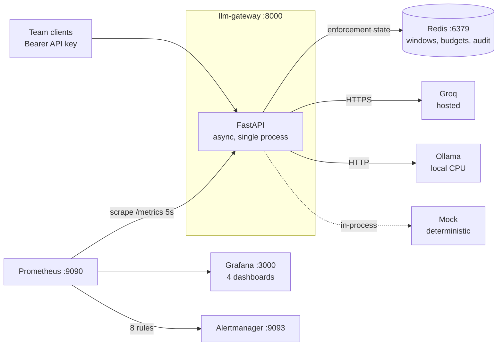
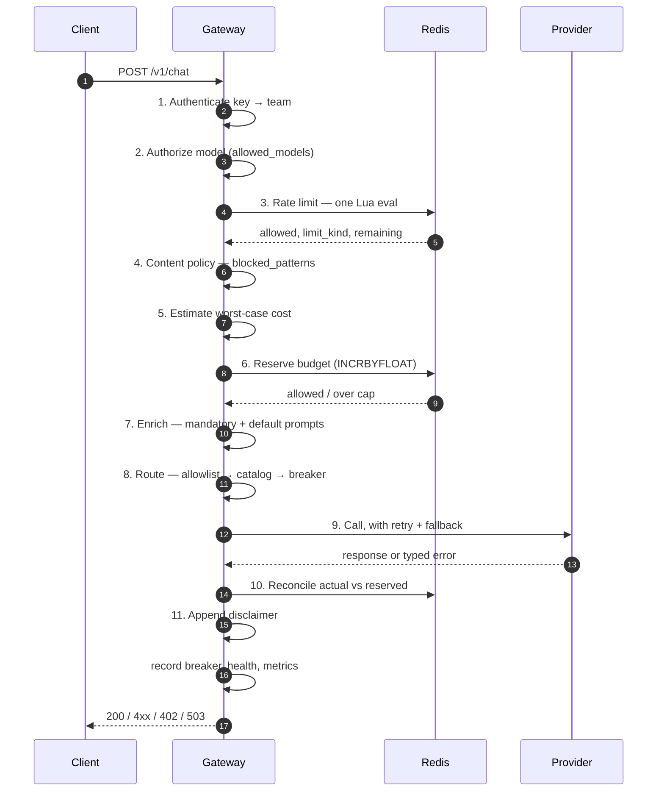
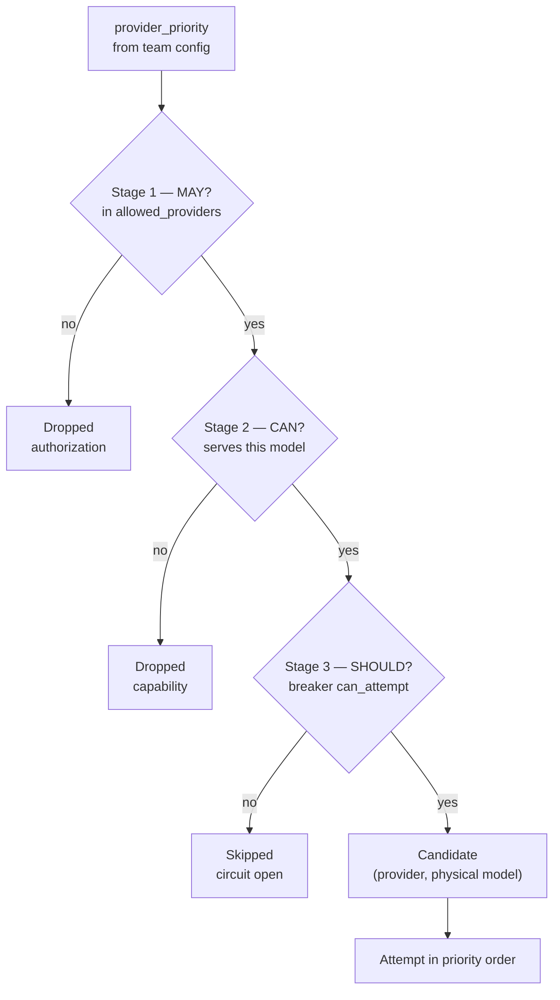
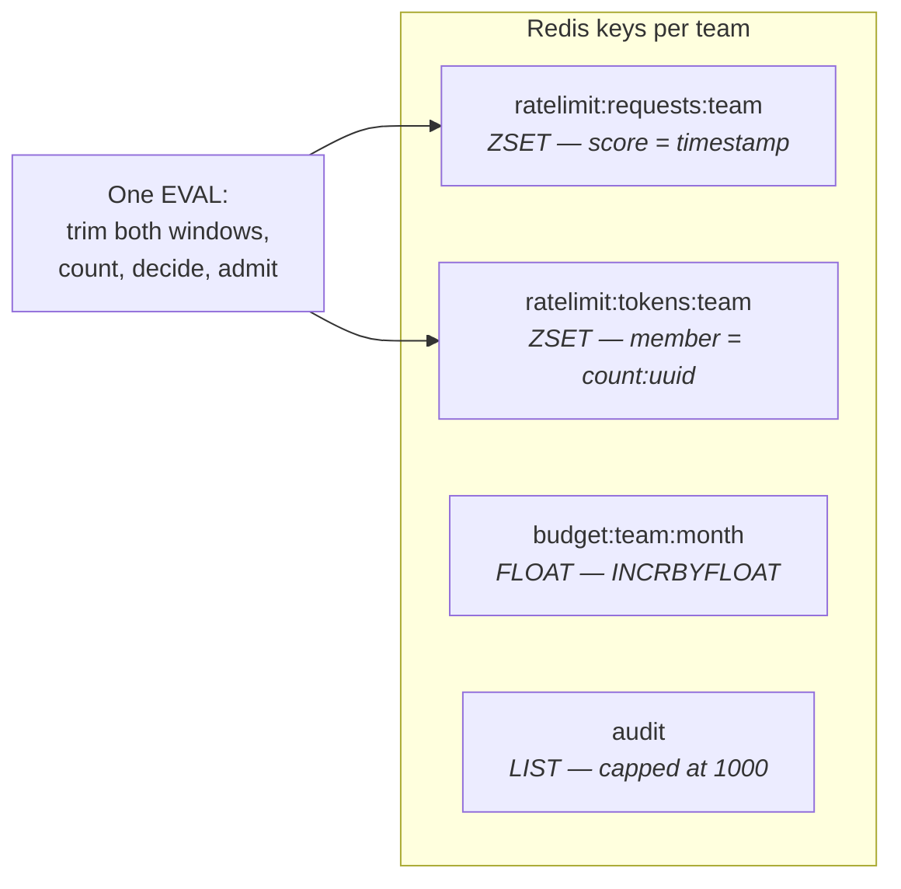
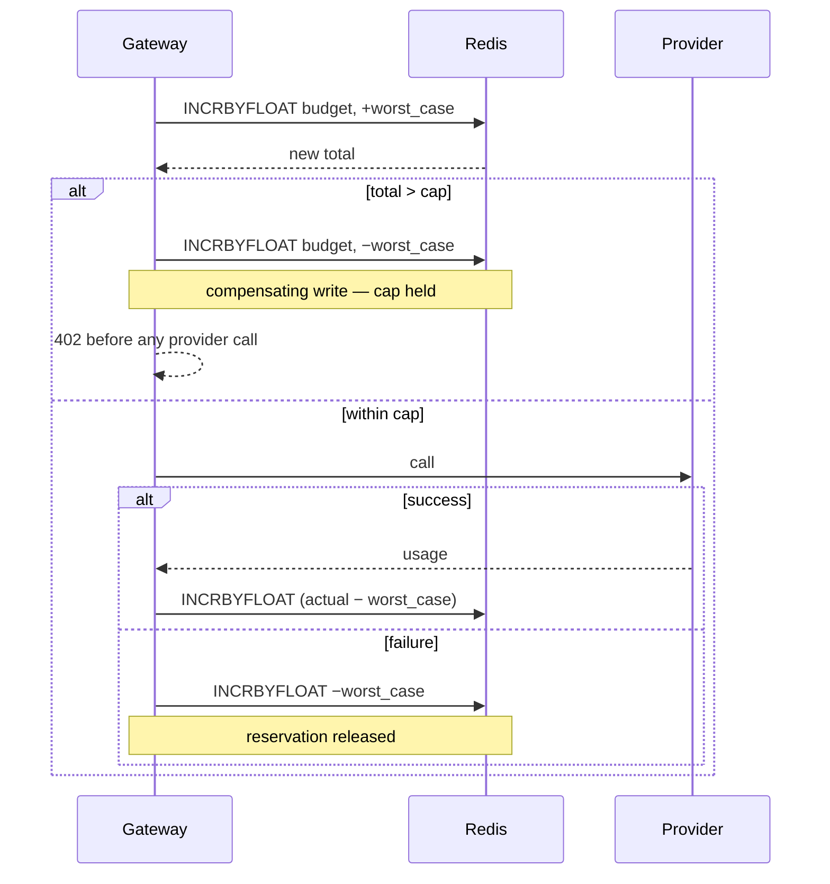
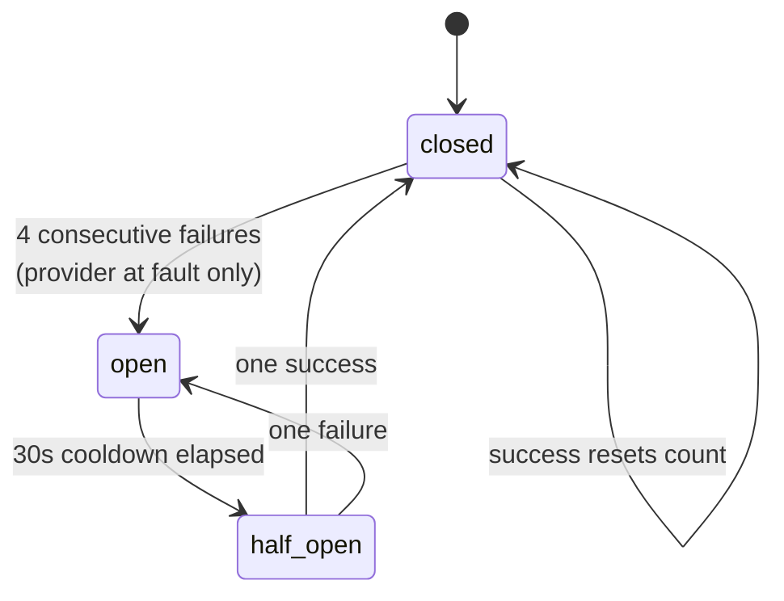

# LLM API Gateway — System Design Record

A multi-tenant proxy that puts one schema, one set of limits and one failure policy in
front of several LLM providers — so that authorization, rate limiting, spend control and
failover are enforced once, centrally, rather than reimplemented by every team that calls
a model.

| | |
|---|---|
| Gateway overhead | **1.67 ms** mean (target: <10 ms) |
| Throughput ceiling | **~450 req/s** single process |
| Tests | 186, offline, no credentials |
| Metrics / panels / alert rules | 14 / 29 / 8 |
| Application code | 2,624 lines across 21 modules |

**Part I** is the architecture. **Part II** is the set of challenges this design invites and
the answers it can support. Every figure here was measured, not estimated; see
[How the figures were established](#how-the-figures-were-established).

---

# Part I — Architecture

## 1. Problem and scope

Several teams in one organisation need to call large language models. Left alone, each
team implements its own retries, its own key handling and its own idea of a budget — and
nobody can answer "what did we spend last month, and on what?"

The gateway is the single ingress that makes those concerns centrally enforceable. A
caller sends one schema to one endpoint; the gateway decides whether that team may use the
requested model, whether it is within its request and token rates, whether the call fits
inside its remaining budget, which provider should serve it, and what to do when that
provider fails.

Three providers are integrated: **Groq** (hosted), **Ollama** (local CPU) and an in-process
**Mock** for deterministic tests and load measurement. The set matters less than the shape —
they have genuinely different latency profiles, quota regimes and disjoint model
catalogues, which is what makes routing and failover non-trivial rather than decorative.

**Deliberately out of scope:** prompt/response caching (a large subsystem with its own
correctness questions), distributed consensus (no durable in-process state to replicate),
and model hosting (the gateway routes, it does not serve weights).

## 2. System context

The gateway holds no durable state of its own; Redis is the system of record for
everything the enforcement path reads and writes.

Prometheus scrapes every `5s` and evaluates rules every `15s`. That split is intentional:
scrape often enough that a short incident leaves samples, evaluate less often so an alert
is not decided on a single scrape.

## 3. Request lifecycle

The ordering of the gates is the design. Each is cheaper than the one after it, and each
can reject before the expensive thing happens.

Steps 1–8 and 11 are the gateway's own work and account for the 1.67 ms overhead figure;
step 9 is provider time and is measured separately.

| Gate | Rejects with | Why it sits here |
|---|---|---|
| Authenticate | `401` | Cheapest possible check; no state read at all. |
| Authorize model | `403` | In-memory set membership. Rejecting here means an unauthorized model never touches Redis. |
| Rate limit | `429` | One Redis round trip. Must precede budget, or a throttled team still moves the budget counter. |
| Content policy | `400` | After the limit, because scanning costs work proportional to prompt size. Before the budget, so blocked content moves no counter and reaches no provider. |
| Budget reserve | `402` | Reserves worst-case cost *before* the call, so the cap holds under concurrency. |
| Route | `503` | Needs the model resolved and breaker state read; no point before the request is known to be payable. |

> **Design note.** Budget is reserved *before* the provider call and reconciled after.
> Checking spend afterwards would make the cap advisory: N concurrent requests would each
> read the same under-cap balance and all proceed. The cost of the guarantee is one
> compensating write on the rejection path.

## 4. Provider abstraction and model tiers

Every provider implements one interface — `chat()` and `chat_stream()` over a
`UnifiedChatRequest`. Provider-specific payload shaping, response parsing and error mapping
live behind it, so nothing above the provider layer knows which vendor is being called.

**The problem tiers solve.** A fallback chain across providers only works if the providers
can serve the same request. But Groq and Ollama host *different models* — there is no model
name valid on both. A naive priority list `["groq", "ollama"]` therefore fails over to a
provider that will reject the model.

`config/models.yaml` declares a capability map and **tiers**: one logical name resolving to
a different physical model per provider. `chat-general` is `openai/gpt-oss-20b` on Groq and
`llama3.2` on Ollama. The caller names the tier; the gateway rebinds the outbound request
per candidate.

Two tiers cross providers, and they express *different* trades — which is the reason a tier
maps per provider rather than naming one model. `chat-general` falls back from hosted to
local, trading latency for availability. `chat-large` falls back from Groq's
`openai/gpt-oss-120b` to local inference, trading capability for it.

The three stages answer different questions and their rejections mean different things,
which is why they are separate rather than one predicate.

> **Bug this distinction caught.** The fallback metric once counted a Groq→Ollama failover
> for a request Groq was never eligible for — the capability filter had already removed it.
> A permanent configuration mismatch was being reported as a transient availability event,
> which would have had somebody investigating a healthy provider.

## 5. Tenancy and enforcement

Four teams, each with an API key, allowed model set, allowed provider set, provider
priority order, optional injected system prompt, request rate, token rate and monthly
budget.

### Rate limiting — two dimensions, one atomic script

Requests per minute and tokens per minute are evaluated together in a **single Lua script**,
as a sliding window over two Redis sorted sets.

> **Why one script, not two checks.** Checking them separately admits a partial failure: a
> request consumes a request slot, then is rejected on tokens. The slot is spent on a
> request that was never served, so the limiter leaks capacity on every partial admission.
> Admission across several dimensions has to be all-or-nothing.

### Budget — reserve, then reconcile

A request's *worst-case* cost is computed before the call — output priced at the caller's
`max_tokens` ceiling, across every physical model the tier could resolve to, so the estimate
is never optimistic.

There is no lock and no read-modify-write; correctness comes from `INCRBYFLOAT` being
atomic and every path having an inverse. An 80% crossing sets an `X-Budget-Warning` header
rather than failing. A floating-point epsilon of `1e-9` guards the comparison so accumulated
rounding cannot refuse a request that is exactly at the cap.

### Policy enrichment

The gateway is the one place every team's traffic passes through, which makes it the place
to enforce rules that would otherwise be reimplemented — and forgotten — by every calling
service. Four policies are configurable per team, and they divide on one axis that matters
more than the feature list: **whether the caller may override them**.

| Setting | Kind | Behaviour |
|---|---|---|
| `system_prompt` | default | Injected only when the caller sent no system message. |
| `mandatory_system_prompt` | **policy** | Injected first, always. No request shape removes it. |
| `response_disclaimer` | policy | Appended to the response; a final chunk when streaming. |
| `blocked_patterns` | policy | `400` before any provider is called. |

> **The distinction is the feature.** Before this, only the default existed — and it read
> like enforcement without being it. Any system message from the caller, not even a
> conflicting one, silently dropped the team's configured prompt. Demonstrated on the
> running system: a team configured to answer only in French returned English as soon as
> the caller sent `{"role":"system","content":"Be terse."}`. A caller did not need to know
> the policy existed to defeat it.

**What "mandatory" does and does not claim.** It guarantees the instruction reaches the
provider — no caller-supplied message shape removes it. It does not guarantee the model
obeys it; prompt-level instruction is not a security boundary. Content that must not be
sent at all belongs in `blocked_patterns`, which the gateway enforces rather than requests.

Patterns are validated when the config loads, not compiled per request. Content policy is
hand-written like the rest of the config, so a malformed regex is a routine mistake —
validating at load hands it to the validate-before-apply path, which refuses the file and
keeps the previous config serving, instead of making it a `500` on live traffic.

The disclaimer is applied **after** accounting. It is gateway text, so billing the team for
tokens the model never generated would overstate their spend.

## 6. Resilience

### Typed failures

Two decisions must be made about every provider failure, and neither is recoverable from an
error string: *can a retry help?* and *is the provider at fault?* The taxonomy carries both
as attributes.

| Class | Retryable | At fault | To client | Meaning |
|---|---|---|---|---|
| `ProviderTimeout` | yes | yes | `503` | No response inside the timeout. |
| `ProviderUnavailable` | yes | yes | `503` | Unreachable, or a 5xx. |
| `ProviderRateLimited` | yes | yes | `503` | Quota. Carries `retry_after`. |
| `ProviderAuthError` | **no** | yes | `502` | Our credentials. Retrying cannot fix it. |
| `ProviderRequestRejected` | **no** | **no** | `400` | The request itself. Provider is working correctly. |

Each attribute buys something concrete. `retryable=false` on an auth error saves the full
`0.5 + 1 + 2 = 3.5s` backoff budget on a call that cannot succeed. `provider_at_fault=false`
stops one malformed prompt pattern from opening a working provider's circuit and removing
it from rotation for every other team. And `retry_after` lets the retry loop abandon
immediately when the provider says the quota outlasts the backoff budget.

### Circuit breaker

While open, requests skip the provider entirely — no retry budget is spent on it.

### Health — learned, not polled

Health is keyed on the **provider–model pair**, with status derived from consecutive
failures (2 → degraded, 4 → down) over a rolling 20-observation window.

It is learned *passively* from real request outcomes. A synthetic probe is spent only where
no cheaper signal exists: a provider never observed, or one whose circuit is open and
therefore receiving no traffic to learn from.

> **Why passive, concretely.** A fixed 10-second probe loop is **8,640 probes/day** against a
> Groq free tier allowing **1,000 requests/day**. The health monitor exhausted the quota it
> existed to protect — silently, since the failures it then observed looked like provider
> problems. Real traffic is a strictly better signal: it reflects what callers actually
> experience, and it costs nothing.

The pair-level key matters because tiers made a provider able to fail on one model while
serving another normally. A provider counts as **down** only when *every* model it serves is
down; one failing model makes it **degraded**.

Groq serves two models, so this is exercised rather than theoretical, and the separation is
not merely bookkeeping: `openai/gpt-oss-120b` measured **0.91 s** against `openai/gpt-oss-20b`
at **0.64–0.79 s**. A per-provider average reports one number for two models that do not
behave alike.

### Streaming

Streaming failures feed the breaker and health exactly as non-streaming ones do. They
previously did not — a hole the size of the primary use case, since a chat gateway's
dominant traffic pattern is streaming.

One asymmetry is inherent and documented rather than fixed: a stream that dies after
partial content has already sent its `200`, and HTTP cannot retract a status line once the
body has begun. The caller sees a truncated success. Both failure shapes are recorded
identically because the gateway should learn the same thing from each; the chunk count is
logged to tell them apart afterwards.

## 7. Observability

Fourteen metrics, four dashboards totalling 29 panels, eight alert rules with three
inhibitions — all provisioned as code, delivering to Slack.

| Dashboard | Answers | Panels |
|---|---|---|
| **Operations** | Is the gateway healthy and are providers behaving? | 8 |
| **Business** | What is each team spending, per hour and per day? | 7 |
| **Performance** | How much latency does the gateway itself add? | 9 |
| **Overview** | At-a-glance summary, the quickest single view. | 5 |

### Three ways a dashboard misleads, and what was done

- **A counter that has never incremented has no series at all.** A naive panel renders "No
  data" where it should render a reassuring `0`. This project hit it **four separate times** —
  a cost panel, a stat panel, an alert that could not fire on the first rejected config
  reload, and the daily-cost panel. Where label values are known and few, both children are
  pre-created at zero. Where they are unbounded (`team × provider × model`) they cannot be,
  so the behaviour is documented in the panel description instead.
- **Percentiles are not subtractable.** Gateway overhead was once computed as end-to-end p95
  minus provider p95 and read **−72 ms**. Two percentiles describe different requests.
  Overhead is now measured per request and aggregated afterwards.
- **Default histogram buckets lied.** The `prometheus_client` defaults start at 5 ms, so 174
  of 180 sub-5 ms samples landed in one undifferentiated bucket and every percentile
  reported the bucket edge — two independent measurements both reading exactly `4.9400 ms`.
  All three latency histograms now use explicit millisecond-resolution buckets.

> Every one of these was found by *looking at rendered output*, not by a failing test. A test
> asserts the value a panel computes; it cannot assert that the value means what a human
> will read it as.

### Alerting

Eight rules cover provider error rate, a provider-model pair down, an entire provider down,
a circuit open, a team at 80% and at 100% of budget, latency above the SLA, and a rejected
config reload — the last being the one that means the file on disk and the running policy
have silently diverged.

Three needed more than a threshold. The error rate excludes the synthetic `provider="none"`
label used for the gateway's own rejections. The budget rules divide by a guarded
denominator, because a team with no cap evaluates to `+Inf` and fires forever. And the two
provider-down rules are separated because health is per-pair: paging "provider is down" for
one failing model overstates an impairment as an outage.

### Delivery, and where the credential lives

Alerts are delivered to Slack. The interesting part is not the integration — a POST to a URL
is a solved problem — but the two things around it that are easy to get wrong.

**The credential is not in the config.** A Slack incoming-webhook URL is a bearer
credential: anyone holding it can post into the channel, with no other authentication. And
`alertmanager.yml` is committed to a public repository. So the receiver reads `api_url_file`,
pointing at a path mounted into the container from a gitignored file, with a committed
`.example` beside it showing the shape. Because the file is read at notification time rather
than at config load, rotating the credential is an edit and a restart rather than a config
change.

**Both routes had to move.** The route tree has a default and a `severity = "critical"`
sub-route. Switching only the default would have sent warnings to Slack while the alerts
actually worth waking someone for — a provider down, a budget exhausted — continued to a
local sink that is not running. A partial cutover that fails *only* for the severe cases is
worse than not cutting over at all, and it would have looked like success from the warnings
alone.

Verified against Slack rather than by reading config: opening the mock provider's circuit
moved `GatewayCircuitBreakerOpen` to firing, and Alertmanager reported
`alertmanager_notifications_total{integration="slack"} = 1` with every
`alertmanager_notifications_failed_total{integration="slack"}` series at zero.

A local sink (`scripts/alert_sink.py`) remains the way this path is verified on a machine
with no Slack credential — it prints exactly what Slack would receive, which is what makes
the *template* verifiable without a secret. Switching back to it is one word in the route.

## 8. Control plane

Eight admin endpoints behind an `is_admin` flag that defaults to false, so tenant keys
cannot read cross-provider health or change gateway state. Limits can be adjusted at
runtime, and the change is **written back into `config/teams.yaml`** through a round-trip YAML
writer that preserves comments and formatting.

> **Why write back rather than overlay in Redis.** A Redis overlay is simpler and faster. It
> also introduces exactly the failure this system exists to prevent: the declared
> configuration and the running policy diverging silently, with no way to tell which is
> authoritative. Writing back keeps the file the single source of truth — a deliberate trade
> of latency for the absence of a class of bug.

Config hot reload re-reads both files on change, **validates before applying**, and swaps the
whole config atomically. A malformed edit is rejected and the previous config keeps
serving, so a YAML typo cannot cause an outage. Every runtime change is recorded in an
audit trail. The update schema sets `extra="forbid"`, so an attempt to set `is_admin` through
the limits endpoint is rejected with `422` rather than silently ignored.

## 9. Performance

Measured with `hey` against the running Compose stack, using the mock provider so the
measurement is of the gateway rather than of inference.

| Concurrency | Throughput | Mean latency | Errors |
|---|---|---|---|
| 1 | 196 req/s | 5.1 ms | 0% |
| 5 | 443 req/s | 11.3 ms | 0% |
| 10 | 415 req/s | 24.0 ms | 0% |
| 50 | 458 req/s | 108.3 ms | 0% |
| 100 | 415 req/s | 236.8 ms | 0% |

**Throughput is flat from concurrency 5 onward** — 415 to 458 req/s across a twentyfold
increase in offered load. That is a ceiling, not a scaling curve: past saturation, added
concurrency converts into queueing delay rather than throughput.

Measured in-process, gateway overhead is **1.67 ms mean** per request with end-to-end handler
time at **2.91 ms**, against the target of under 10 ms.

> **The number that looks alarming and is not.** At concurrency 100 the overhead histogram
> reads **240 ms p99**. Little's Law gives `100 ÷ 415 = 241 ms`. That is not the gateway
> getting slower — per-request work is unchanged at 1.67 ms. It is queueing, and it is
> arithmetically forced at that concurrency and that ceiling.
>
> It also never arises in production: against real providers the bottleneck is inference,
> at roughly **1.5 req/s** — about 300× below the gateway's own ceiling. The provider is the
> queue long before the gateway is.

The ceiling itself is I/O, not CPU. Each request makes roughly **five Redis round trips**: the
rate-limit `EVAL`, budget reserve, token-usage write, its expiry, and spend reconcile. That
is the price of the enforcement guarantees, and it is why the answer to "make it faster" is
replicas rather than optimisation.

## 10. Deployment and scaling

One `docker compose up` brings up all five containers with Grafana's datasource and
dashboards already provisioned. The gateway runs as a **single uvicorn process**; the
published throughput figure is therefore a single-process number.

| State | Lives in | Across replicas |
|---|---|---|
| Rate-limit windows | Redis | correct, shared |
| Budgets and spend | Redis | correct, shared |
| Audit trail | Redis | correct, shared |
| Circuit breaker | Process memory | **per replica** |
| Health monitor | Process memory | **per replica** |

The enforcement guarantees hold across replicas because their state is in Redis. The
resilience state does not: with N replicas, each learns provider failure independently, so
roughly `4N` failed requests pass before the whole fleet is protected rather than 4.

This is a defensible design rather than an oversight — per-instance breakers are what
Hystrix did, and they prevent one replica's bad view from black-holing traffic fleet-wide.
But it is a real property, and it is the honest answer to "how does this scale?"

## 11. Limitations and deliberate deferrals

| Item | State | Reasoning |
|---|---|---|
| Output-side content filter | **not built** | Filtering *input* is cheap and certain. Filtering *output* on a stream is not: the tokens are already sent by the time you could judge them. Buffering defeats streaming; per-chunk filtering misses anything spanning a boundary. Deliberately skipped rather than half-done. |
| Streaming fallback | partial | A mid-stream failure genuinely cannot fail over — bytes are already sent. A failure *before* the first chunk could, and does not yet. |
| OpenTelemetry tracing | deferred | Metrics answer the questions this system is asked. Distributed tracing earns its cost across service boundaries; there is one service here. |
| Priority queues | deferred | Meaningful only under sustained saturation. At 450 req/s against providers serving 1.5 req/s, the gateway is never the queue. |
| Health → routing | by design | The breaker is the authority on whether to attempt; health is observational. Coupling them lets a bad signal black-hole traffic. |
| Token bucket | **diverges** | The spec says token bucket; this is a sliding window. A bucket permits bursts up to its depth; a window does not. The window was chosen for multi-tenant fairness — but it *is* a divergence. |

> **A note on pricing as a hard dependency.** Adding a model to `config/models.yaml` without
> adding it to `MODEL_PRICING` makes every request for it fail closed with a `500` rather
> than serving it unmetered. Budget enforcement that silently stops applying to one model
> is worse than a refusal that says so.

---

# Part II — Questions and answers

**450 req/s seems low for a gateway. Why so slow?**
Because it is not a byte proxy. Each request makes about five Redis round trips — the
rate-limit `EVAL`, budget reserve, token write, expiry, and spend reconcile — and that is the
cost of the enforcement guarantees. The gateway's own CPU work is 1.67 ms; the ceiling is
I/O. Compare it to nginx and you are comparing different workloads. It also scales
horizontally, because the enforcement state is in Redis rather than in the process.

**Your overhead is 1.67 ms but your dashboard shows 240 ms. Which is it?**
Both, measuring different things. 1.67 ms is the gateway's work at low concurrency. 240 ms
appears at concurrency 100, and it is queueing: Little's Law says latency equals concurrency
over throughput, and 100 ÷ 415 is 241 ms. Per-request work does not change. The figure I
quote is the one the gateway controls.

**How do you guarantee the budget cap under concurrent requests?**
By reserving before calling, not checking after. Worst-case cost is added atomically with
`INCRBYFLOAT`; if the new total exceeds the cap the reservation is compensated back and the
request is refused. N concurrent requests each see the effect of the others because each has
already incremented. Checking spend afterwards would make the cap advisory — they would all
read the same under-cap balance and all proceed. There is a test that runs concurrent
reservations against a cap and asserts it holds.

**Why not just check both rate limits with two Redis calls?**
Because that admits a partial failure. The request consumes a request slot, then gets
rejected on tokens — the slot is spent on a request that was never served, and the limiter
leaks capacity on every such admission. Multi-dimensional admission has to be
all-or-nothing, which means one script.

**Why sliding window rather than the token bucket the spec asked for?**
This is a genuine divergence and worth naming rather than hiding. A token bucket permits a
burst up to its depth, which is friendlier to bursty clients but lets one tenant consume a
disproportionate share of a shared window. The sliding window is stricter and fairer across
tenants, which suited a multi-tenant gateway. The trade is real: bursty-but-compliant
clients are treated less generously than a bucket would treat them.

**What happens if a provider starts failing halfway through a streamed response?**
The client cannot be told. The `200` and the first chunks are already on the wire, and HTTP
has no way to retract a status line once the body has begun — so the caller sees a truncated
success. What *can* be done is make sure the gateway learns: the breaker and health monitor
are fed identically for both streaming and non-streaming failures. The chunk count is logged
so the two failure shapes can be told apart afterwards. Before this was fixed, streaming
failures were invisible to both — which for a chat gateway meant the resilience layer did
not cover the dominant traffic pattern.

**How does this behave with three replicas behind a load balancer?**
Rate limits, budgets and audit stay correct — they are in Redis. The circuit breaker and
health monitor are process-local, so each replica learns provider failure independently:
roughly `4N` failed requests before the fleet is protected rather than 4. That is a
deliberate choice, the same one Hystrix made, and it avoids one replica's bad view
black-holing traffic for everyone. Moving breaker state to Redis is possible; it trades a
round trip on the hot path and a shared failure domain for faster fleet-wide reaction.

**Your health monitor once took down your own provider access. What happened?**
A fixed 10-second probe loop is 8,640 probes a day. The Groq free tier allows 1,000 requests
a day. The monitor exhausted the quota it existed to protect, and the failures it then
observed looked like provider problems rather than self-inflicted ones. The fix was to
invert the model: learn health passively from real request outcomes, which are a better
signal anyway, and spend a synthetic probe only where no cheaper signal exists.

**Why write config changes back to YAML instead of keeping an overlay in Redis?**
The overlay is simpler and avoids a file write on the admin path. But it creates a state
where the declared config and the running policy differ with no way to tell which is
authoritative — which is the exact class of bug this system's config handling exists to
eliminate. Writing back keeps the file as the single source of truth. It is a deliberate
trade of a little latency on a rare path for the absence of a whole failure mode.

**Why is health separate from routing? Isn't that wasted signal?**
It is signal deliberately not acted on. The circuit breaker is the authority on whether to
attempt a provider; health is observational. If health also drove routing, a bad health
signal could divert traffic away from a provider that is actually fine — a monitoring
artifact becoming an outage. The breaker reacts on evidence of actual failed attempts.
Keeping them separate costs some reaction speed and buys a failure mode I would rather not
have.

**How do you stop a caller bypassing your policy prompt?**
By separating two things that looked like one. `system_prompt` is a *default* — injected
only when the caller sent none, and overridable on purpose. `mandatory_system_prompt` is a
*policy* — injected first, and no request shape removes it. That distinction exists because
the original behaviour was a default that read like enforcement: any system message, not
even a conflicting one, silently dropped the team's prompt. I demonstrated it on the running
system before fixing it — a team configured to answer only in French returned English the
moment the caller sent their own system message. What I will not claim is that a mandatory
prompt makes the model obey; it guarantees the instruction reaches the provider, nothing
more. Content that must not be sent at all goes in `blocked_patterns`, which the gateway
enforces rather than requests.

**Where do your secrets live?**
Not in the repository, and the alerting credential is the example worth giving because it
was nearly got wrong. A Slack incoming-webhook URL needs no other authentication — holding it
is enough to post — and `alertmanager.yml` is committed to a public repo. The obvious
instruction, "replace the placeholder `api_url` with your real URL", would have published a
live credential and made rotating it a history rewrite. It reads `api_url_file` instead,
from a gitignored file mounted into the container, with a committed `.example` showing the
shape. Provider API keys follow the same rule through `.env`, which is gitignored with an
`.env.example` beside it. The test suite needs no credential at all, which is why CI runs it
with no secrets configured.

**What is the weakest part of this system?**
Output-side content filtering, which I deliberately did not build. Filtering input is cheap
and certain — reject before paying for a provider call. Filtering output on a stream is not:
by the time you could judge a token you have already sent it. Buffering the whole response
defeats the point of streaming, and per-chunk filtering misses anything spanning a chunk
boundary. Both are worse than being honest about the gap. After that, the pre-first-chunk
streaming fallback — a mid-stream failure genuinely cannot fail over, but one before the
first byte could, and that is now cheap because streaming errors are typed.

**What did you get wrong and have to fix?**
Several things, and the pattern is more interesting than any one of them. Four controls
looked real and were not: an allowlist that was never enforced, admin endpoints with no
authentication, a budget cap that could be breached under concurrency, and a health monitor
that consumed the quota it protected. Separately, the same Prometheus defect — a labelled
counter having no series until its first increment — appeared four times in different
disguises, including an alert that could not fire on the first occurrence of the thing it
existed to detect.

What they share is that none were found by tests. They were found by operating the system
and looking at what it actually produced.

---

## How the figures were established

Throughput and latency were measured with `hey` against the running Compose stack on
2026-09-28, using the mock provider so the measurement isolates the gateway from inference.
In-process overhead was taken by reading the histogram's `_sum` and `_count` before and after
a 500-request run at concurrency 1, giving a mean rather than an interpolated percentile.
Counts of tests, metrics, panels, rules and endpoints were taken from the source tree, not
from memory. The 240 ms queueing figure was read from Prometheus at concurrency 100 and
cross-checked against Little's Law.

Scope as documented: 186 tests, 14 metrics, 29 panels across 4 dashboards, 8 alert rules,
3 inhibitions, 11 endpoints, 3 providers serving 4 models, 4 model tiers, 4 teams, and
roughly 2,800 lines of application code against 3,100 lines of tests across 37 commits.
